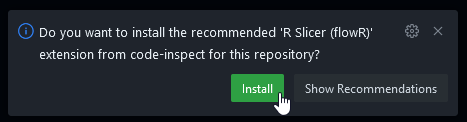

# *flowR* Sample Codespace

This is a template repository that you can use to try out the *flowR* extension for Visual Studio Code right in your browser using [GitHub codespaces](https://github.com/features/codespaces). You don't even need to create your own repository!

 

 

## How to Use

To set up your own *flowR* Sample Codespace, simply click the button above or use the **Use this template** button at the top-right of this repository.

The codespace will take a few seconds to set up. After the codespace has fully loaded, a notification should pop up that asks you to install the *flowR* extension. Click **Install** to get the extension up and running.

The *flowR* extension in the codespace will then connect to a remote *flowR* server, so you'll be able to do anything that you can do with the *flowR* extension on Desktop.

## Things to Try

You can generate a [slice](https://github.com/flowr-analysis/flowr/wiki/Terminology#program-slice) of the currently highlighted variable in any of the sample code by using the **Slice for Cursor Position** command. All code that is not part of the generated slice will then be grayed out.

You can also view the reconstruction of a piece of code based on the current slice. The **Show Current Slice in Editor (Reconstruct)** command opens a view next to the current editor.

The extension has a lot more features to try! For a more extensive list, check out [the extension's README](https://github.com/flowr-analysis/vscode-flowr?tab=readme-ov-file#use).
